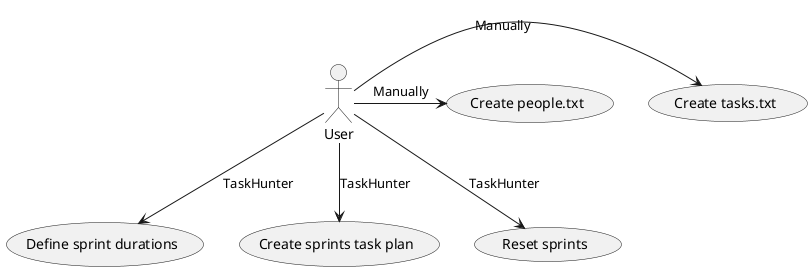
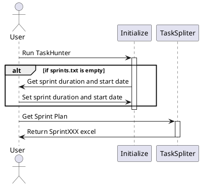

# Requirement Understanding Document of TaskHunter V0.0

## Requirements

- tasks.txt
	- User creates it firstly, and can edit it any time
	- Tool can update of tasks lates date. When was it did lates
- people.txt
	- Only user can create and edit it.
- sprints.txt
	- Tool creates it according to users input
	- It keeps sprint duration, start and finish dates of current sprint.

## Use Case

## Sequance Diagram

